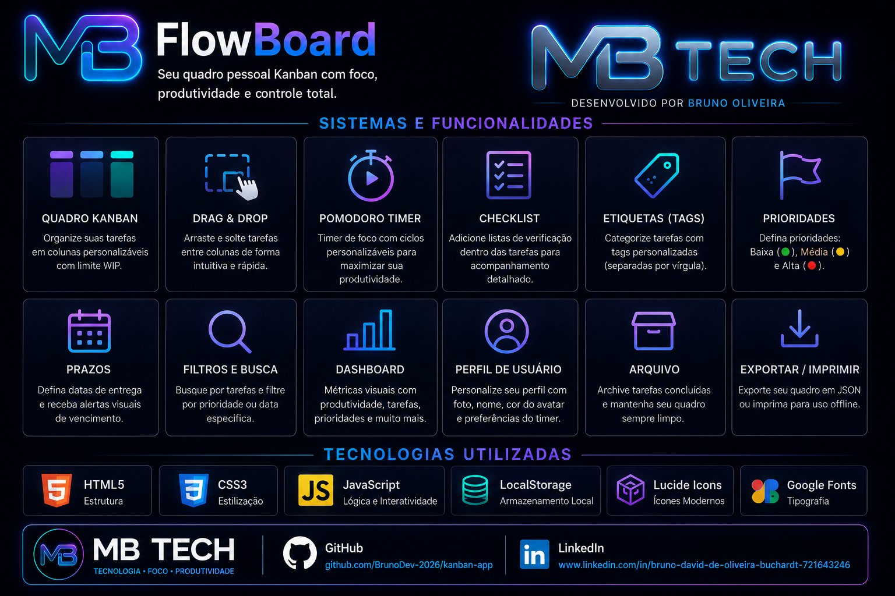

# <p align="center">MB FlowBoard 🚀</p>

<p align="center">
  <strong>Seu quadro pessoal Kanban com foco, produtividade e controle total.</strong>
</p>

<p align="center">
  <a href="https://github.com/BrunoDev-2026/kanban-app">
    
  </a>
  &nbsp;
  <a href="https://www.linkedin.com/in/bruno-david-de-oliveira-buchardt-721643246">
    
  </a>
</p>

---

<p align="center">
  
</p>

---

## ✨ Visão Geral

O **MB FlowBoard** é uma aplicação de gerenciamento de tarefas premium, projetada com estética moderna e foco total na experiência do usuário. Desenvolvido com tecnologias web nativas e backend Node.js + Firebase, oferece um ambiente fluido para organizar seu trabalho com eficiência e estilo.

> [!NOTE]
> Frontend em **JavaScript Vanilla** · Backend em **Node.js + Express + Firebase Firestore** · Deploy no **Render.com**

---

## 🚀 Principais Recursos

| Funcionalidade | Descrição |
|---|---|
| 🎯 **Quadro Kanban** | Colunas personalizáveis com limite WIP |
| ⚡ **Drag & Drop** | Mova tarefas entre colunas intuitivamente |
| ⏲️ **Pomodoro Timer** | Ciclos de foco personalizáveis |
| ✅ **Checklist** | Listas de verificação dentro das tarefas |
| 🏷️ **Etiquetas (Tags)** | Categorize tarefas com tags personalizadas |
| 🔴 **Prioridades** | Baixa, Média e Alta prioridade |
| 📅 **Prazos** | Alertas visuais de vencimento |
| 🔍 **Filtros e Busca** | Filtre por prioridade, tag ou data |
| 📊 **Dashboard** | Métricas visuais de produtividade |
| 👤 **Perfil de Usuário** | Avatar, nome, cor e preferências do timer |
| 📦 **Arquivo** | Archive tarefas concluídas |
| 💾 **Exportar / Imprimir** | Exporte em JSON ou imprima offline |
| 📱 **PWA** | Instale como app no celular ou desktop |

---

## 🛠️ Tecnologias Utilizadas

**Frontend:** HTML5 · CSS3 · JavaScript ES6+ · LocalStorage · Lucide Icons · Google Fonts

**Backend:** Node.js · Express · Firebase Firestore · Render.com

---

## 🏗️ Estrutura de Pastas

```text
kanban-app/
├── assets/          # Imagens, ícones, logos
├── backend/         # API Node.js + Firebase
│   └── server.js
├── css/             # Estilos modulares
├── js/              # Lógica em módulos
│   ├── app.js       # Orquestrador principal
│   ├── api.js       # Comunicação com o backend
│   ├── storage.js   # Persistência localStorage
│   ├── tasks.js     # Gestão de tarefas
│   ├── dragdrop.js  # Drag & Drop nativo
│   └── utils.js     # Utilitários e sanitização
├── manifest.json    # PWA
├── sw.js            # Service Worker
└── index.html
```

---

## ⚙️ Como Rodar Localmente

```bash
git clone https://github.com/BrunoDev-2026/kanban-app.git
cd kanban-app/backend
npm install
node server.js
```

Abra o `index.html` no navegador ou use o Live Server do VS Code.

---

## 🌐 Deploy

| Serviço | URL |
|---|---|
| **API** | https://kanban-app-ff84.onrender.com |
| **Health** | https://kanban-app-ff84.onrender.com/health |

> ⚠️ Plano gratuito do Render hiberna após 15 min. Primeira requisição pode demorar ~50s.

---

## 👨‍💻 Desenvolvido por

<p align="center">
  <strong>Bruno Oliveira — MB Tech</strong><br>
  <em>Tecnologia · Foco · Produtividade</em>
</p>

<p align="center">
  <a href="https://github.com/BrunoDev-2026/kanban-app">
    
  </a>
  &nbsp;
  <a href="https://www.linkedin.com/in/bruno-david-de-oliveira-buchardt-721643246">
    
  </a>
</p>

---

<p align="center">
  <em>"Esse projeto está em constante evolução."</em><br>
  <strong>EVOLUIR É O PLANO. 🚀</strong>
</p>
